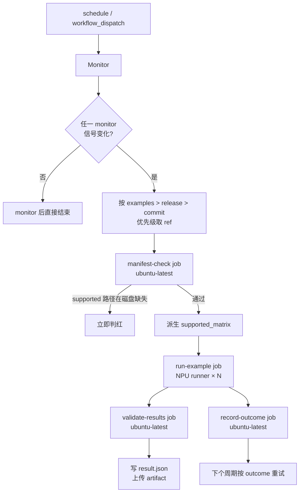

# ms-swift Example 看护 设计文档

## 1. 设计目的

### 1.1 目标

ms-swift 项目在 [projects.yaml](../projects.yaml) 里注册为「训练加速 / 基础支持 / 阶段 A」——即上游已有昇腾 example 但我们尚未把看护合入上游社区。本设计的目标是：在本仓（[workflows](https://github.com/cosdt-ci-test/workflows/)）的 GitHub Actions 上，把 ms-swift 上游 `examples/ascend/` 下能跑通的训练/推理 example **定期调度到 NPU runner 上跑**，上游 example 文件发生变动、release 发版、main 出现新 commit 时自动触发；example 退出码非 0 即判红，通过 job API 与 artifact 把每条 example 的成败对外暴露。

设计起点：截至 2026-09-10，本仓已有 [ms-swift-examples.yml](../.github/workflows/ms-swift-examples.yml) 与 [ms-swift-quick-start.yml](../.github/workflows/ms-swift-quick-start.yml) 两条流水线；清单 [examples_manifest.yaml](../projects/ms-swift/examples_manifest.yaml) 中 12 条 supported、约 200 条 unsupported；项目脚本 [setup_example.sh](../projects/ms-swift/scripts/setup_example.sh)、[run_example.sh](../projects/ms-swift/scripts/run_example.sh) 已稳定运行。本设计文档化这一状态，不是引入新行为，而是把现有的实现重新组织为可读的设计视图。

### 1.2 范围

仅覆盖 ms-swift example 看护（即 `ms-swift-examples.yml` 这条流水线及其项目脚本）。quick-start 文档看护（`ms-swift-quick-start.yml` + [test_quick_start_ascend.py](../projects/ms-swift/tests/test_quick_start_ascend.py)）走的是另一套模板（[quick-start-template.yml](../.github/workflows/quick-start-template.yml)），虽然命名相似但机制不同，本文不展开。

跨项目共享的部分（轮询协议、清单 + 差集机制、result.json 契约）写在 [docs/guarding-examples.md](guarding-examples.md) 里，本文引用之。

### 1.3 关键约束

- runners 全部位于中国大陆，无法访问 docker hub、HuggingFace，pip 走 [华为云镜像](https://repo.huaweicloud.com/ascend/repos/pypi) 或集群内缓存。
- 上游 ms-swift example 脚本内联 `ASCEND_RT_VISIBLE_DEVICES=0,1`，运行时环境变量无法覆盖，清单 `npu_devices` 必须与之一致（[docs/guarding-examples.md](guarding-examples.md) 红线条款）。
- 看护目标是**诚实地暴露 example 退出码**，不修上游 example。
- 当前 `ms-swift-examples.yml` 的 `schedule` 已注释，只保留 `workflow_dispatch` 手动触发，目的是节约 NPU runner 时间。

## 2. 设计逻辑

### 2.1 概念空间

为说清本设计，先明确一组概念：

- **上游例子（upstream example）**：ms-swift 仓 `examples/` 目录下一个可执行的 shell / python / yaml 脚本，代表软件的一种训练或推理用法。
- **看护条目（guard entry）**：清单 `examples_manifest.yaml` 的 `supported` 段中的一项，绑定一条上游例子到本仓流水线的一次具体执行：runner、卡号、镜像、超时、profile、压规模参数。
- **Profile**：example 的环境族。ms-swift 当前有 5 个：`swift` / `deepspeed` / `vllm` / `megatron` / `megatron_vllm`。每个 profile 对应 [setup_example.sh](../projects/ms-swift/scripts/setup_example.sh) 中一个 `setup_<profile>` 函数，决定装哪些依赖。Profile 不影响 example 本身，只影响 example 跑起来之前要准备什么。
- **Overlay 参数（overlay_args）**：写在 `supported` 条目里的「把 example 压到 CI 规模」的命令行参数（如 `--max_steps 1 --output_dir ${CI_OUTPUT_DIR}`），由 `run_example.sh` 展开后在调用 example 时附加。
- **Monitor 信号（monitor signal）**：上游 ms-swift 的三个时间序列——`examples/` 最新 commit、latest release tag、main HEAD SHA。轮询通过任一信号变化判断是否需要触发。
- **Monitor 状态（monitor state）**：上一周期记录的三个信号值与各自 outcome，存 `actions/cache` 目录 `.monitor-state/`。
- **Fixture**：仓内 fixture 文件（[fixtures/ci_sft_8.jsonl](../projects/ms-swift/fixtures/ci_sft_8.jsonl)、[fixtures/ci_sft_packed_16.jsonl](../projects/ms-swift/fixtures/ci_sft_packed_16.jsonl)），作为 overlay 里 `--dataset` 引用，避免 example 去拉 HuggingFace。
- **CI 输出目录（CI_OUTPUT_DIR）**：本仓 GitHub Actions 工作区里 example 写产物的目录，对应 manifest-check 的 `supported_matrix` 不必关心，但 `overlay_args` 里写明 `--output_dir ${CI_OUTPUT_DIR}`，是 example 退出码可信的前提。

### 2.2 整体流程



调度单元：清单 `supported` 中每个条目 → 一个 matrix 项 → 一个 `run-example` job（并行上限 4）。`run-example` 包含：checkout 目标仓 → 源 CANN 环境 → `setup_example.sh <profile>` → `run_example.sh <path>`。

### 2.3 关键设计选择

#### 2.3.1 触发：轮询而非上游 push

上游 ms-swift 没有部署任何 CI hook，我们不可能让上游 push 触发本仓流水线。改为本仓 `monitor` job（ubuntu-latest，免费 runner，几秒完成）轮询 GitHub API 比对三个信号。这是 [docs/guarding-examples.md](guarding-examples.md)「要求 2」的统一做法，本设计复用之。

被测 ref 优先级 `examples > release > commit`：examples 信号最弱（一次 commit 只触碰 `examples/`，但通常意味着 example 本身有改动），release 信号最强（每次发版是公开承诺），commit 是兜底。三者只有第一个变化的信号参与本次 run；其余信号即使也变化了，下个周期还会轮询到。

**取舍**：也可以让一个周期跑三次（每次一个信号），但这样 NPU runner 占用翻三倍，价值不高——只有第一个变化信号最贴近「这次应该测的版本」。当前的「按优先级合并到一个 ref」是性价比最好的选择。

#### 2.3.2 调度：清单驱动而非 workflow 硬编码

`run-example` 的 strategy matrix 不在 YAML 里写死任何具体 example、runner、卡数，而是从 manifest-check 输出的 `supported_matrix` JSON 里读。`npu_devices` 字符串（`"0,1"` / `"0,1,2,3"` 等）由 [scripts/check_examples_manifest.py](../scripts/check_examples_manifest.py) 的 `device_options_from_npu_devices` 派生 `--device=/dev/davinciN` 挂载。

收益：加一条 supported 只改清单 + 必要时改 overlay_args / exec / setup 分支；workflow 文件本身不动。**已 supported 但路径已不在磁盘上时 manifest-check 立即判红**，避免 NPU runner 装完依赖才发现 example 没了（白白消耗 ~20 分钟 NPU 时间）。

#### 2.3.3 环境：profile 抽象而非堆 case

ms-swift 训练栈有多种组合：纯 swift、swift+deepspeed、swift+vllm、swift+megatron、swift+megatron+vllm。每个组合需要装一组不同的二进制。如果按 example 维度展开，会出现大量重复——很多 qwen3_5 的 example 都用 megatron_vllm profile。

引入 `profile` 这一层抽象：[setup_example.sh](../projects/ms-swift/scripts/setup_example.sh) 中每个 `setup_<profile>` 函数封装一族 example 的环境准备。Profile 是 example 的环境族，不是 example 本身的属性；同一 profile 下多 example 共享同一次 `setup_example.sh` 调用产物。未知 profile 必须先以非 0 退出并打印支持的 profile 列表（[setup_example.sh:186-189](../projects/ms-swift/scripts/setup_example.sh#L186)）。

vLLM 系列涉及 ABI 锁定（[vllm-ascend 0.23 ABI = torch 2.10](vllm-ascend-0.23-abi-torch-2.10.md)），通过 `PIP_CONSTRAINT` 在 vLLM 系列切换到 [constraints-npu-vllm.txt](../projects/ms-swift/constraints-npu-vllm.txt)，其它 profile 走 [constraints-npu.txt](../projects/ms-swift/constraints-npu.txt)。这是环境层的硬约束，不是看护机制的逻辑，因此放在 setup 脚本里、不进 manifest。

#### 2.3.4 运行：overlay 而非 fork

不修改上游 example 文件本体。当 overlay_args 非空时，[run_example.sh](../projects/ms-swift/scripts/run_example.sh) 在 CI 临时工作区里：

1. 用 Python 检查 example 是否已含 `"$@"`（已有就跳过）；
2. 没有则定位 `--model_name swift-robot` 标志或最后一条命令行，**就地**追加 `"$@"`——这个改动只发生在 CI 目标仓 checkout 的副本里，**绝不** `git add` / `commit` / `push`；
3. 展开 `OVERLAY_ARGS`（JSON 数组，支持 `${FIXTURE_DIR}` / `${CI_OUTPUT_DIR}` 等环境变量）；
4. megatron 系列同时把 `<your_local_megatron_lm_path>` 占位符替换成 `setup_example.sh` 注入到 `$GITHUB_ENV` 的 `MEGATRON_LM_PATH`。

退出码即结果，**不比对 loss**——保证「上游行为是否仍然与文档一致」这个判断不被 CI 规模 fixture 的微小数值差异污染。

#### 2.3.5 失败语义：单信号级别的重试

看护失败不是「整个 pipeline 失败」就结束，而是按**信号级别**重试：`record-outcome` job 把本次三个信号的成败分别写回 `.monitor-state/.<signal>_outcome`；下次 monitor 即使没有任何信号变化，只要 `outcome != success`，就以 `<signal>-retry` 为由再跑一次（[ms-swift-examples.yml:75-78](../.github/workflows/ms-swift-examples.yml#L75)）。

这是为了应对上游某次 commit 引入了 breaking change 而我们的 supported 条目还没跟进——下个周期会再跑一次暴露出来，而不是默默吞掉。

### 2.4 不在范围内的事

- **不**校验 example 输出数值。CI 跑的是小 fixture，loss 与上游生产规模无可比性。
- **不**为 ms-swift 单独写 result schema；共用 [schemas/result.schema.json](../schemas/result.schema.json)。
- **不**试图跨 runner 切分 example（`max-parallel: 4` 是 GHA 上限，不是 ms-swift 特有的）。
- **不**改写 ms-swift 上游 example 文件。看护诚实暴露失败，重定向由上游 PR 处理。

## 3. 核心数据结构

### 3.1 清单 [examples_manifest.yaml](../projects/ms-swift/examples_manifest.yaml)

```yaml
version: 1
scan:                              # 扫描规则（影响 manifest-check 的差集输入）
  root: examples
  include_extensions: ['.sh', '.py', '.yaml']
supported:                         # 本仓实际调度的条目
  - path: examples/ascend/train/qwen3/qwen3_lora_megatron.sh
    profile: megatron              # setup_example.sh 的 profile 参数
    runner: linux-aarch64-a2-2     # runner 标签，后缀 N 是可用 NPU 卡数
    npu_devices: '0,1'             # 卡号，逗号分隔；与 example 内联 ASCEND_RT_VISIBLE_DEVICES 必须一致
    image: swr.../cann:9.1.0-...   # 容器镜像
    overlay_args:                  # 压 CI 规模的命令行参数，可选
      - --dataset ${FIXTURE_DIR}/ci_sft_8.jsonl
      - --logging_steps 1
      - --max_length 512
    timeout_minutes: 180
unsupported:                       # 磁盘上有但本仓不跑；机制同 supported 但不进 matrix
  - examples/ascend/multi-node/megatron/node1.sh   # 注释里说明不支持原因
  ...
```

**关键约束**：每个 supported 条目 `path` 在磁盘上必须存在；`npu_devices` 必须匹配 `^\d+(,\d+)*$`；`overlay_args` 必须是字符串列表（不能是裸数字，YAML 会收成整数导致 schema 校验失败）。

### 3.2 Monitor 状态 `.monitor-state/`

| 文件 | 内容 |
|------|------|
| `.examples_head` | 上次记录的上游 `examples/` 最新 commit SHA |
| `.examples_outcome` | `success` / `failure`（或不存在） |
| `.last_release_tag` | 上次记录的上游 latest release tag |
| `.release_outcome` | 同上 |
| `.last_tested_sha` | 上次记录的上游 main HEAD SHA |
| `.commit_outcome` | 同上 |
| `.<signal>_failure_reason` | 失败原因（供日志阅读） |

通过 `actions/cache` 持久化，cache key 前缀 `ms-swift-examples-monitor-state-`（[docs/guarding-examples.md](guarding-examples.md) 要求：与同项目 quick-start 的 `quick-start-monitor-state-ms-swift_` 前缀互不为前缀，否则 restore-keys 会串状态）。

### 3.3 结果产物

每个 `run-example` job（无论成败）由 `validate-results` job 写一份 [result.json](../schemas/result.schema.json)：

```json
{
  "trigger": "schedule | workflow_dispatch",
  "target_repo": "modelscope/ms-swift",
  "target_ref": "main HEAD SHA 或 tag",
  "path": "examples/ascend/train/qwen3/qwen3_lora_megatron.sh",
  "image": "swr.../cann:9.1.0-910b-...",
  "job_status": "success | failure | cancelled"
}
```

artifact 名 `ms-swift-examples-<run_id>-<job-index>`，外部机器按 GitHub Job API 或读 artifact 即可拿到每条 example 的结果。

## 4. 接口定义

### 4.1 上游契约（GitHub API 轮询）

```
GET https://api.github.com/repos/modelscope/ms-swift/commits?sha=main&path=examples&per_page=1
GET https://api.github.com/repos/modelscope/ms-swift/releases/latest
GET https://api.github.com/repos/modelscope/ms-swift/commits/main
```

monitor job 顺序调用三个端点，把 SHA / tag 与 `.monitor-state` 比较。任一端点 5xx 即视为信号未变（不触发）。

### 4.2 清单扫描

```
python3 scripts/check_examples_manifest.py \
  --target-root target \                          # 目标仓 checkout 的根
  --manifest workflows/projects/ms-swift/examples_manifest.yaml \
  --result-json manifest_check_result.json \      # 输出：差集 + supported
  --target-repo "$TARGET_REPO" --target-ref "$TARGET_REF" \
  --trigger "$TRIGGER"
```

行为：

- 输入：`target-root` 的磁盘状态 + `--manifest` 清单。
- 输出：
  - `manifest_check_result.json`：含 `new_paths` / `stale_paths` / `supported`。
  - `$GITHUB_OUTPUT`：追加 `supported_matrix<<EOF\n<JSON>\nEOF\n` + `has_supported=true|false`，供 `run-example` matrix 引用。
- 退出码：`supported` 条目 `path` 在磁盘缺失 → 1；否则 0。

### 4.3 项目脚本契约

**`setup_example.sh <profile>`**（[setup_example.sh:1-3](../projects/ms-swift/scripts/setup_example.sh#L1) 注释）

- 位置参数：`$1` 是清单条目的 `profile`（如 `megatron`）。
- 未知 profile 必须先以非 0 退出并打印 supported profile 列表。
- 入口流程：`select_pip_index` → `ensure_torch_stack` → `install_ms_swift` → `setup_<profile>`。
- `setup_vllm` 编译 vllm 0.23.0 + 装 `vllm-ascend==0.23.0`（ABI 锁 torch 2.10）。
- `setup_megatron` clone Megatron-LM / MindSpeed / mcore-bridge，导出 `MEGATRON_LM_PATH`。
- `setup_megatron_vllm` = `setup_megatron` + `setup_vllm`（顺序依赖）。

**`run_example.sh <example-relpath>`**（[run_example.sh:1-7](../projects/ms-swift/scripts/run_example.sh#L1) 注释）

- 位置参数：`$1` 是 example 相对目标仓根的路径。
- 环境变量：`PROJECT_ROOT` / `TARGET_ROOT` / `FIXTURE_DIR` / `CI_OUTPUT_DIR` / `ASCEND_RT_VISIBLE_DEVICES` / `OVERLAY_ARGS` / `EXEC` / `MEGATRON_LM_PATH`。
- `OVERLAY_ARGS` 是 JSON 数组，每项是字符串，支持 shell 引号、`$VAR` / `${VAR}` 展开。
- 行为：在 CI 临时工作区里给 example 补 `"$@"`（无侵入），展开 overlay，替换 `<your_local_megatron_lm_path>`，最后 `bash "$EXAMPLE_PATH" "${EXTRA_ARGS[@]}"`。
- 退出码即 example 退出码，不比对任何数值。
- 红线：只改 CI 工作区里的目标仓副本，**绝不** `git add` / `commit` / `push`。

### 4.4 内部接口

**Workflow → project script**：`run-example` job 通过 env 注入契约约定的环境变量，调用 `setup_example.sh` / `run_example.sh`。两脚本除位置参数外无 stdin / stdout 协议，stdout 全是日志，job 日志完整记录。

**`monitor` → `run-example`**：通过 `$GITHUB_OUTPUT` 传递 `target_repo` / `target_ref` / `trigger` / `reason`；`run-example` 用前者 checkout 目标仓，`validate-results` 把后者写入 result.json。

**`run-example` → `validate-results`**：通过 GitHub Job API（`gh api /repos/.../actions/runs/<run_id>/jobs`）查 job conclusion，写 result.json。NPU runner 不写 artifact（artifact 上传在 GitHub 基础设施上跑）。

## 5. 一致性校验

| 维度 | 校验点 |
|------|--------|
| 概念一致性 | 全文一致使用「supported 条目 / profile / overlay / monitor signal / monitor state / fixture / CI 输出目录」；不混用「run case / job / test」。 |
| 状态完备性 | monitor 三信号 ×（changed / unchanged） × outcome（success / failure / 不存在）共 12 种组合在 [ms-swift-examples.yml:60-134](../.github/workflows/ms-swift-examples.yml#L60) 的三段 bash 中均有处理：无变化且无失败 → unchanged；信号变化 → changed=true + 写新 SHA + 清 outcome；失败遗留 → changed=true + ref 用旧 SHA + 加 `-retry` 后缀。 |
| 接口完备性 | 设计逻辑中提到的每个操作都有对应接口：monitor（GitHub API）、清单（`check_examples_manifest.py`）、setup（`setup_example.sh`）、run（`run_example.sh`）、结果（`validate-results` 写 result.json）、重试（`record-outcome` 写 outcome）。 |
| 层次一致性 | 本层（看护机制）只负责：触发判断、调度矩阵、结果收集。不实现：环境准备（项目脚本）、清单扫描（共享脚本）、NPU 调度（GHA 自身）。 |
| 红线 | `run_example.sh` 不发任何对目标仓远端的写操作；example 文件只在 CI 工作区被改，不写回上游。 |
| 缓存键隔离 | `ms-swift-examples-monitor-state-` 与 quick-start 的 `quick-start-monitor-state-ms-swift_` 互不为前缀（[docs/guarding-examples.md](guarding-examples.md) 要求）。 |
| 卡号一致性 | 清单 `npu_devices` 与 example 内联 `ASCEND_RT_VISIBLE_DEVICES` 必须一致（[docs/guarding-examples.md](guarding-examples.md) 红线）。ms-swift-examples.yml 12 条 supported 与 example 内联值均已对齐。 |

## 6. 变更历史

| 日期 | 变更原因和内容 |
|------|----------------|
| 2026-09-10 | 初版设计文档：基于 [ms-swift-examples.yml](../.github/workflows/ms-swift-examples.yml) 当前状态（`schedule` 已注释、12 条 supported、5 个 profile）梳理看护机制。设计起点：现有实现，文档化为可读的设计视图，不引入新行为。 |
| 2026-09-11 | 引用更新：quick-start 引擎的 monitor-state 缓存键硬化为 `quick-start-monitor-state-ms-swift_*`（严格格式 + 属主校验），本文 §3.2 / §5 的引用同步更新。本文描写的 ms-swift-examples.yml 本身未变。 |
